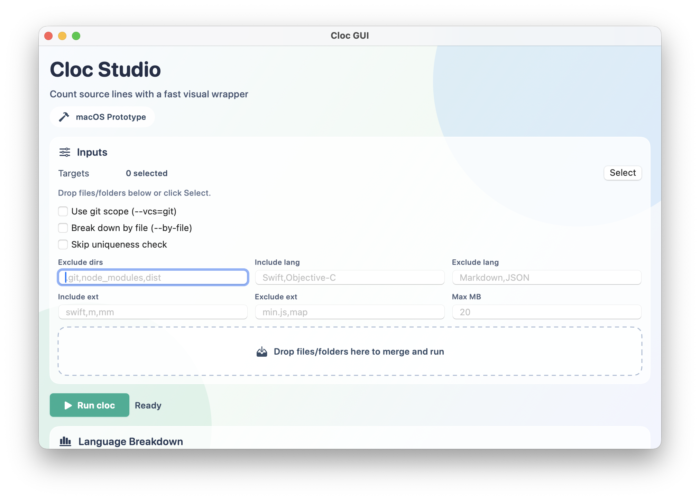
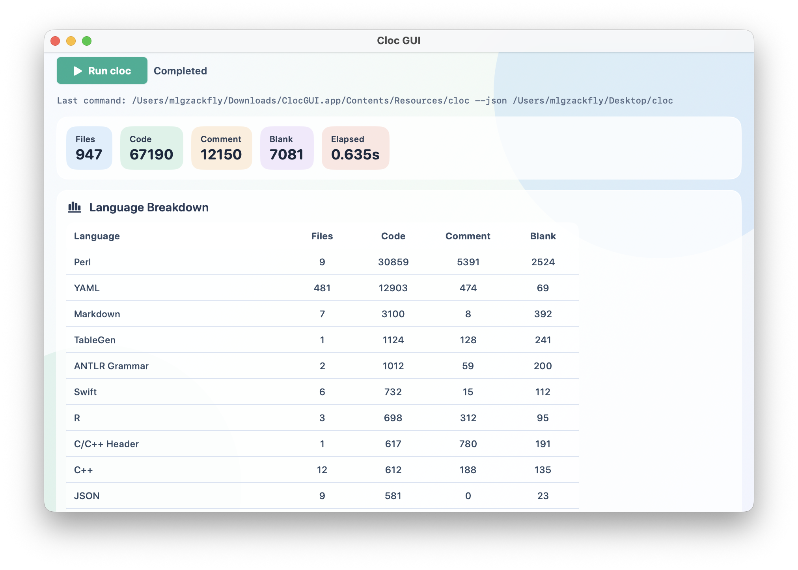

# cloc-studio

`cloc-studio` is a macOS SwiftUI desktop app for visualizing code-count results from `cloc`.

## IMPORTANT: Upstream Credit
This project is a GUI wrapper for `cloc`.

Core counting engine and language logic come from the upstream `cloc` project by **Al Danial** and contributors:

- Upstream repository: https://github.com/AlDanial/cloc
- Upstream author: Al Danial

`cloc-studio` does **not** replace `cloc`; it only provides a macOS desktop interface on top of it.

## Screenshots
Overview:



Execution result:



## Upstream and attribution
This project is a GUI wrapper around **cloc** by Al Danial.

- Upstream project: https://github.com/AlDanial/cloc
- Upstream tool name: `cloc` (Count Lines of Code)
- Bundled runtime in this repo: `vendor/cloc`

Please keep this attribution when redistributing `cloc-studio`.

## License and compliance
`cloc` is distributed under GNU GPL (v2 or later, per upstream notices). Because this app bundles and redistributes `cloc`, releases of `cloc-studio` must preserve GPL obligations.

When sharing binaries (`.app`, `.zip`), make sure to:

- Include copyright and license notices for upstream `cloc`.
- Provide corresponding source code for the redistributed version (including your modifications).
- Keep recipients informed that `cloc` is GPL-licensed and where source can be obtained.

Before public release, review the upstream `LICENSE` and notices in the `cloc` script header.

This repository includes:
- `LICENSE` (GPL text from upstream)
- `NOTICE` (upstream attribution and bundled-component notice)

## Features
- Multi-select files/folders and drag-and-drop input.
- Visual summary and language breakdown for `cloc --json` results.
- UI-based filters (include/exclude language/ext, max file size, etc.).
- Standalone packaging with bundled `vendor/cloc`.

## Local development
```bash
cd macos-gui
swift build
swift run ClocGUI
```

## Package app
```bash
cd macos-gui
./scripts/package_app.sh
```

Output:
- `dist/ClocGUI.app`
- `dist/ClocGUI.zip`

## If macOS blocks opening the app
If Gatekeeper blocks launch for a downloaded build, remove quarantine attributes:

```bash
xattr -d com.apple.quarantine /path/to/ClocGUI.app
```

If needed for nested files:

```bash
xattr -dr com.apple.quarantine /path/to/ClocGUI.app
```

## Notarized release (optional)
```bash
cd macos-gui
APP_SIGN_IDENTITY="Developer ID Application: YOUR NAME (TEAMID)" \
NOTARIZE=1 \
NOTARY_PROFILE="your-notary-profile" \
./scripts/package_app.sh
```

## GitHub Actions release
This repository includes two workflows:

- `.github/workflows/create-tag.yml`: manual workflow to create `vX.Y.Z` tags.
- `.github/workflows/release-on-tag.yml`: auto-build and GitHub Release on tag push.

Required repository secret:

- `RELEASE_PAT`: Personal Access Token used by `create-tag.yml` to push tags.
  - Recommended scopes (classic PAT): `repo`, `workflow`
  - Why needed: tags pushed by default `GITHUB_TOKEN` do not trigger the second workflow.

Release flow:

1. Push code to `main`.
2. Run **Create Release Tag** workflow in GitHub Actions with version (for example `0.1.0`).
3. Tag `v0.1.0` is created and pushed.
4. **Release on Tag** workflow builds `dist/ClocGUI.zip` and publishes a GitHub Release with:
   - `ClocGUI.zip`
   - `ClocGUI.zip.sha256`
