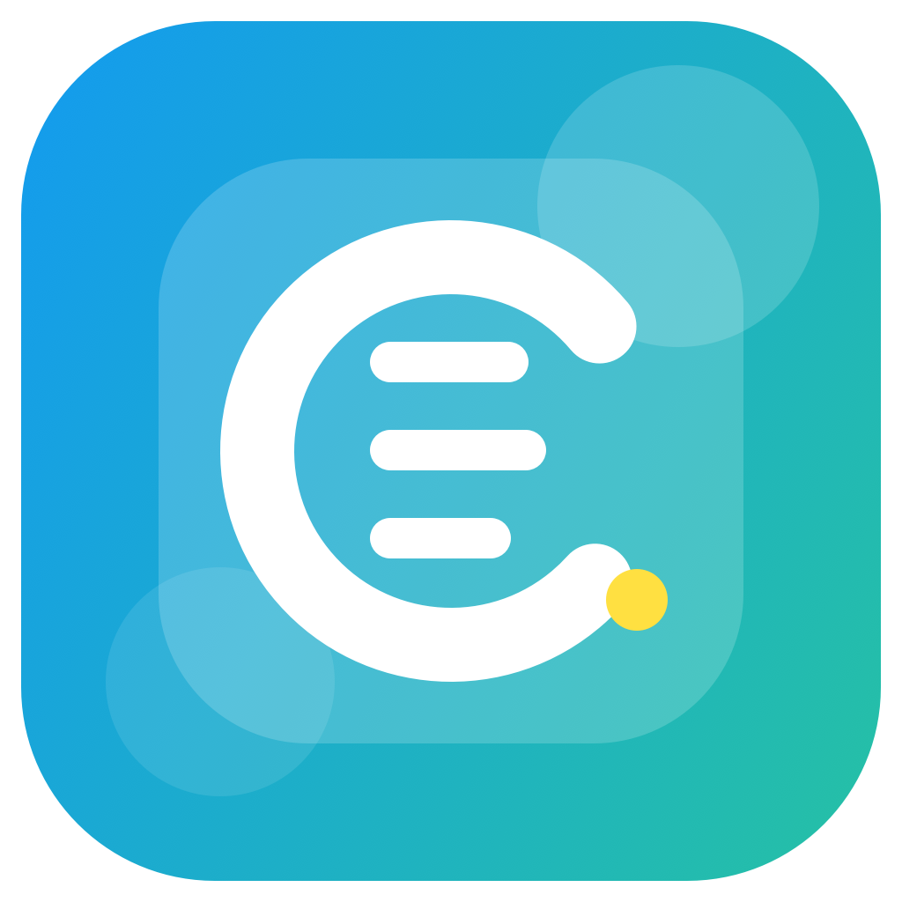
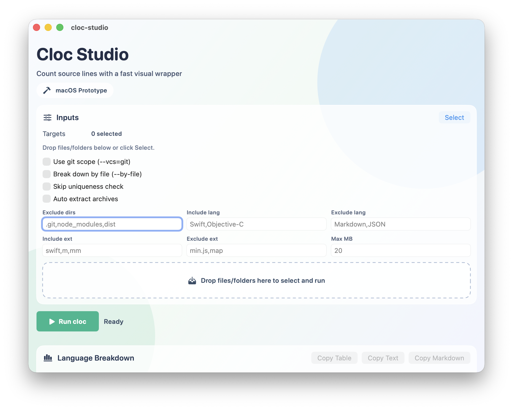
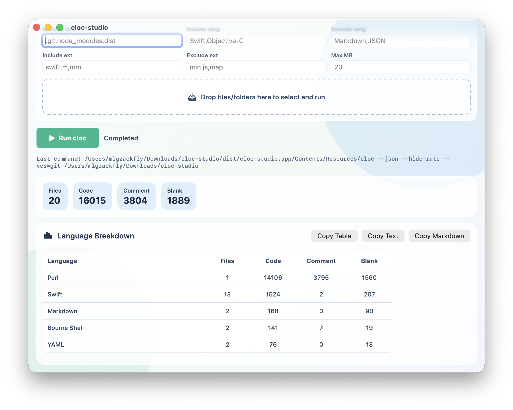

# cloc-studio

`cloc-studio` is a macOS SwiftUI desktop app for running and visualizing [`cloc`](https://github.com/AlDanial/cloc) code-count reports.



The app bundles `vendor/cloc` for standalone builds and provides a desktop workflow for selecting targets, applying common filters, and copying language breakdowns.

## Screenshots

### Overview



### Results



## Features

- Select multiple files or folders, including drag-and-drop input.
- Run `cloc --json` through a visual macOS interface.
- Filter by language, extension, directory, maximum file size, git scope, and uniqueness checks.
- Review summary totals and language-level breakdowns.
- Copy results as plain text, Markdown, TSV, or HTML table content suitable for Word.
- Package a standalone `.app` with the bundled `vendor/cloc` executable.

## Requirements

- macOS 13 or later.
- Xcode command line tools or Xcode with Swift 6.1-compatible tooling.

## Local Development

```bash
swift build
swift run cloc-studio
```

For development only, you can point the app at a local `cloc` executable:

```bash
CLOC_STUDIO_LOCAL_CLOC=/absolute/path/to/cloc swift run cloc-studio
```

## Package App

```bash
./scripts/package_app.sh
```

The packaging script:

- Builds the release binary.
- Generates the app icon assets.
- Verifies `vendor/cloc` against `vendor/cloc.sha256`.
- Bundles `vendor/cloc` into `Contents/Resources/cloc`.
- Signs the app with an ad-hoc identity by default.
- Creates `dist/cloc-studio.app` and `dist/cloc-studio.zip`.

## Optional Notarized Release

```bash
APP_SIGN_IDENTITY="Developer ID Application: YOUR NAME (TEAMID)" \
NOTARIZE=1 \
NOTARY_PROFILE="your-notary-profile" \
./scripts/package_app.sh
```

Set `STAPLE=0` to submit for notarization without stapling the returned ticket.

## GitHub Actions Release

This repository includes two release workflows:

- `.github/workflows/create-tag.yml`: manually creates a `vX.Y.Z` tag.
- `.github/workflows/release-on-tag.yml`: builds the app and publishes a GitHub Release when a `v*` tag is pushed.

Required repository secret:

- `RELEASE_PAT`: Personal Access Token used by `create-tag.yml` to create tags through the GitHub API.

Recommended `RELEASE_PAT` permissions:

- Use a fine-grained PAT.
- Grant repository `Contents: Read and write`.
- Rotate the token regularly and revoke it immediately if exposed.

Release flow:

1. Push code to `main`.
2. Run the **Create Release Tag** workflow with a version such as `0.1.0`.
3. The workflow creates and pushes `v0.1.0`.
4. **Release on Tag** builds and publishes:
   - `cloc-studio.zip`
   - `cloc-studio.zip.sha256`

## If macOS Blocks Opening the App

If Gatekeeper blocks a downloaded build, remove quarantine attributes only after verifying that the app came from a trusted source:

```bash
xattr -d com.apple.quarantine /path/to/cloc-studio.app
```

If needed for nested files:

```bash
xattr -dr com.apple.quarantine /path/to/cloc-studio.app
```

## Upstream Attribution

`cloc-studio` is a GUI wrapper around **cloc** by Al Danial and contributors. It does not replace `cloc`; it provides a macOS interface on top of the upstream counting engine and language logic.

- Upstream project: https://github.com/AlDanial/cloc
- Upstream tool name: `cloc` (Count Lines of Code)
- Bundled runtime in this repo: `vendor/cloc`

Please keep this attribution when redistributing `cloc-studio`.

## License and Compliance

`cloc` is distributed under GNU GPL (v2 or later, per upstream notices). Because this app bundles and redistributes `cloc`, releases of `cloc-studio` must preserve GPL obligations.

When sharing binaries (`.app`, `.zip`), make sure to:

- Include copyright and license notices for upstream `cloc`.
- Provide corresponding source code for the redistributed version (including your modifications).
- Keep recipients informed that `cloc` is GPL-licensed and where source can be obtained.

Before public release, review the upstream `LICENSE` and notices in the `cloc` script header.

This repository includes:

- `LICENSE` (GPL text from upstream)
- `NOTICE` (upstream attribution and bundled-component notice)
